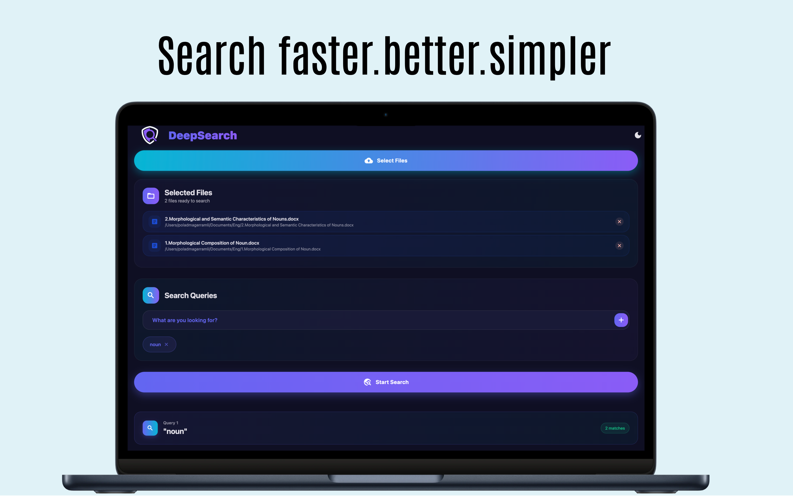
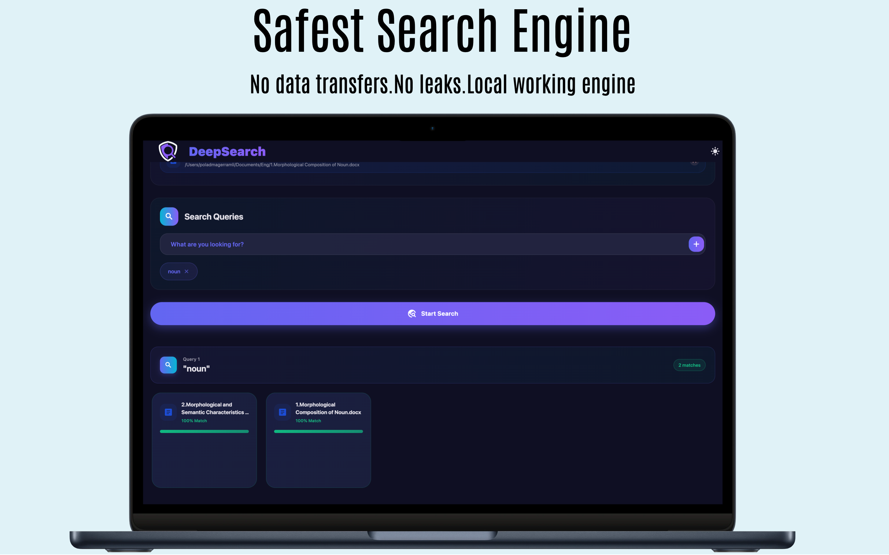

# DeepSearch
**DeepSearch is a high-performance local semantic search engine that allows users to upload documents and perform meaning-based queries across their contents. It runs entirely on your machine, ensuring your data remains private.**

## Table of Contents
- [Overview](#overview)
- [Automatic Installation](#automatic-installation)
- [How to Use](#how-to-use)

## Overview
DeepSearch is designed for anyone who needs to find information within a large collection of personal or professional documents.
The application runs as a local server with a clean, user-friendly web interface, making it easy to upload files and search through your entire digital library.
### Features: 
1. Multi-Format Support: Upload and search through PDF, DOCX, and plain text files.

2. Runs Locally: All your files and the search index are stored on your machine. Nothing is sent to the cloud.

3. High Performance: Built with a combination of Go, C++,Dart and Python for optimal speed and efficiency.
 
4. Simple UI: Clean and intuitive interface for searching your documents.

## Automatic Installation
You can download the latest pre-built version for macOS and Linux operating systems from the Releases page.

- macOS: Download the .dmg file, open it, and drag DeepSearch.app to your Applications folder.

- Linux: Download the .deb package or .tar.gz archive.

## How to Use
1. Launch the application. This will start the local servers and open interface.

2. Upload Documents. Drag and drop your files (PDF, DOCX, TXT) into the upload area.

3. Start Searching. Type your query into the query bar.

4. Review Results. The search results will show the most relevant passages from your documents, ranked by semantic similarity.